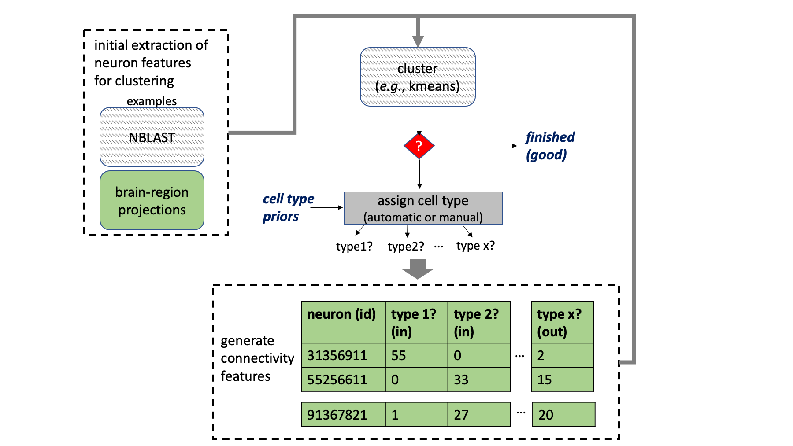

# CBLAST
Cluster neurons based on synaptic connectivity to derive cell types.

This application has numerous strategies for extracting features for different
neurons that can be used for automatic clustering.  These tools can be run offline
or within Jupyer notebooks to faciliate interactive exploration.

# installation and running

Install [conda](https://docs.conda.io/en/latest/miniconda.html).

    % conda create -n cblast
    % conda install scipy scikit-learn umap-learn jupyter hvplot bokeh plotly neuprint-python pyarrow -n cblast -c conda-forge -c flyem-forge
    % source activate cblast 
    % git clone https://github.com/connectome-neuprint/cblast.git
    % cd cblast; python setup.py install
    % export NEUPRINT_APPLICATION_CREDENTIALS=YOURTOKEN
    % jupyter notebook 

To use the library, import cblast.  Please see the [notebook example](/cblast%20example.ipynb).

# background and data requirements

CBLAST tries to cluster nodes in a graph. The edge weights are determined by synapses.  The nodes are neurons.
For good cluster results, the dataset should have the following:

* all (most) connections from the set of neurons should be traced at least within a given region (i.e., a dense connectome is preferable)
* defined, synapse-level brain regions, which is useful for performing initial neuron clustering.

The general CBLAST strategy is shown in the image below.  The algorithm clusters neurons based on the cell types they connect to, similar neurons should connect to similar things in similar ways.  However, this means one needs cell types to determine cell types.  CBLAST is an iterative approach that starts with initial putative cell types and successive refinement.

To generate the initial putative types, one can use morphological matching algorithms like NBLAST or generate features based on how a neuron intersects various brain regions.  This library provides provides algorithms that considers upstream and downstream projections of a given neuron.

Because the final determination of cell type groupings requires a somewhat subjective determination of when certain feature differences or similarities mean one should split or group neurons, this tool was also designed for visual exploration.  Cluster plots can provide clues about what should be grouped.  Exact feature differences or similarities can be visualized to help determine whether neurons should really be grouped or not.  The morphology of these neurons should then be inspected
using a tool like neuprint explorer. 

In practice, for fly brain, we observe cluster results that are generally consistent with morphology.  But there are many cases where neurons of the same morphology have different connection patterns.  CBLAST also aims to be somewhat resilient to variations of absolute location of neurons within brain regions, as compared to NBLAST.

# todo

* more metrics for outlier analysis
* provide option to generate features without neuprint (from pre-generated
connectivity and ROI data)
